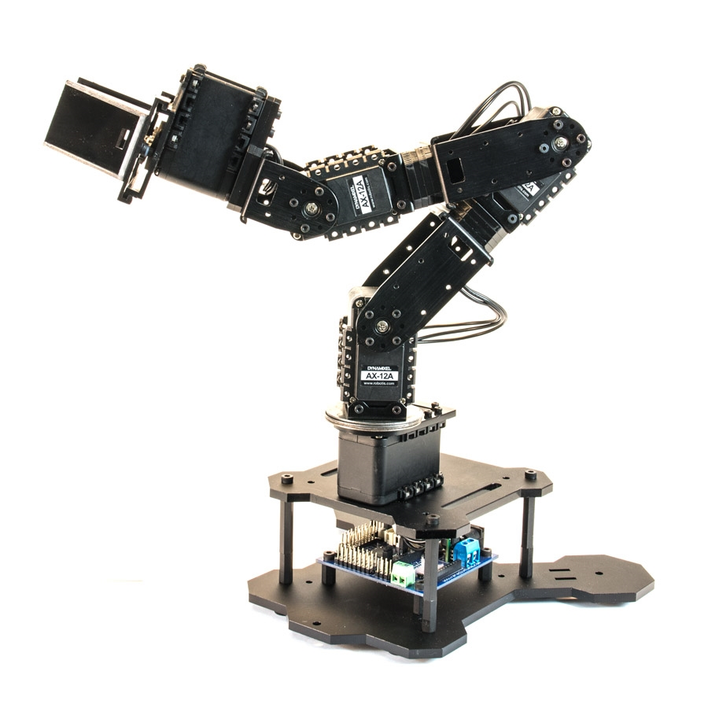
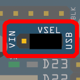
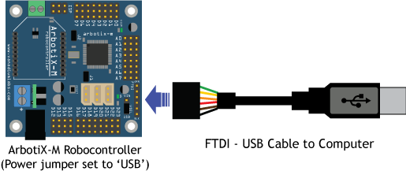
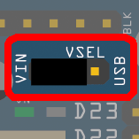
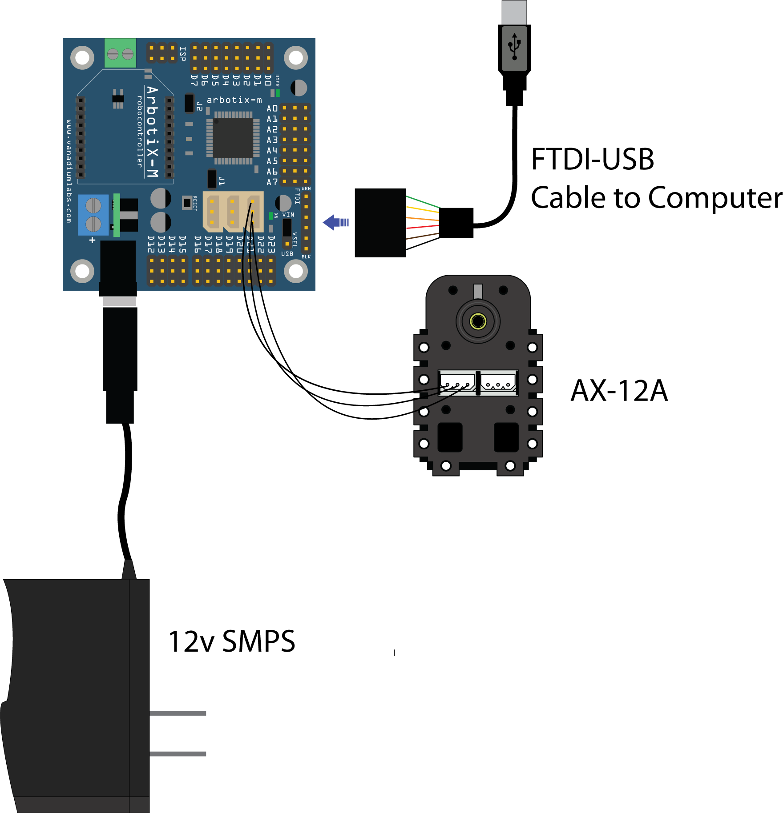
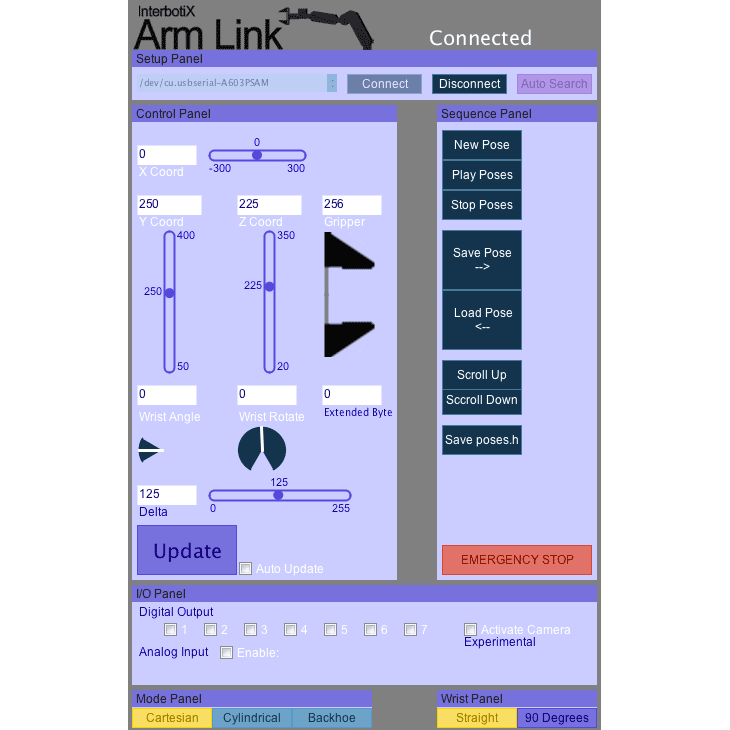

The main purpose of this chapter is to familiarize ourselves with pincher arm hardware through using official software.

## Preparations
Read and know the required tools in advance.     
[PhantomX Pincher Robot Arm Kit Mark II Turtlebot Arm](https://www.trossenrobotics.com/p/PhantomX-Pincher-Robot-Arm.aspx) 

[Interbotix Labs](https://github.com/Interbotix)

## Test
Note that the following refer to the official website:  
[PhantomX Pincher Robot Arm Getting Started Guide](https://learn.trossenrobotics.com/interbotix/robot-arms/pincher-arm)  
### Step 1. Setting Up ArbotiX-M & Arduino Software
Note that the following refer to the official website:   
[ArbotiX-M Robocontroller Getting Started Guide](https://learn.trossenrobotics.com/arbotix/arbotix-quick-start.html)   
The main parts of setting up the ArbotiX-M are as follows:   
1. [Install the Arduino IDE (1.0.6 version)](https://www.arduino.cc/en/Main/OldSoftwareReleases)   
2. [Install the FTDI drivers](https://www.ftdichip.com/Drivers/VCP.htm)   
3. [Install and configure the ArbotiX-M Hardware and Library Files](https://github.com/trossenrobotics/arbotix/archive/master.zip)   
4. Connect ArbotiX-M Robocontroller to Computer: Move the power jumper so that it connects the middle pin and the 'USB' pin, or otherwise it is possible that we can't program the board.      
   
Connect the Arbotics-M to computer through FTDI-USB cable.    
  
5. Program the ArbotiX-M Robocontroller      
Move the power jumper towards 'VIN'. This allow you to power the ArbotiX-M from the external power supply.   

Suppose we want to control a DYNAMIXEL Servo, the single servo setup for arbotiX-M is show as bellow:

### Step 2. Setting DYNAMIXEL IDs
[Setting DYNAMIXEL IDs with the DynaManager](https://learn.trossenrobotics.com/index.php/getting-started-with-the-arbotix/1-using-the-tr-dynamixel-servo-tool#&panel1-1)

### Step 3. Building Pincher
[PhantomX Pincher Robot Arm Assembly Guide](https://www.trossenrobotics.com/productdocs/assemblyguides/phantomx-basic-robot-arm.html)

### Step 4. Testing Pincher
[PhantomX Pincher Robot Arm Build Check](https://learn.trossenrobotics.com/interbotix/robot-arms/16-phantomx-pincher-robot-arm/25-phantomx-pincher-robot-arm-build-check)

## Arm Link
[Arm Link Overview](https://learn.trossenrobotics.com/projects/144-arm-link-overview.html)

### Step 1. Firmware Installation
The Arm Link Library and Firmware is automatically installed with the ArbotiX Hardware & Library files and does not need to be installed separately.    
1.Open the ArmLinkSerial firmware from the Arduino IDE.   

    File -> Examples -> Arm Link -> InterbotixArmLinkSerial

2.Modify/uncomment code at line 56 to define the arm. 

    //#define ARMTYPE PINCHER
    //#define ARMTYPE REACTOR
    //#define ARMTYPE WIDOWX

Now the firmware can be load onto the ArbotiX-M. Leave FTDI cable plugged into the computer, as this is how the software will communicate with the Arm.

### Step 2. Software Installation
[DOWNLOAD THE ARM LINK CONTROL SOFTWARE](https://github.com/trossenrobotics/ArmLinkSoftware/releases/)

### Step 3. Usage

### Step 4. Advanced Uses
[Arm Link Sequence Playback](http://learn.trossenrobotics.com/36-demo-code/143-arm-link-sequence-playback.html) - Use the Arm Link software to create and export sequences to stand-alone firmware for the arms.    
[Arm Link Packet Reference](http://learn.trossenrobotics.com/arbotix/arbotix-communication-controllers/31-arm-link-reference.html) - Technical details on the Arm Link Packet and integrating it into your own projects   
[Arm Link Software Advanced Use](http://learn.trossenrobotics.com/35-projects/138-interbotix-arm-link-software-advanced-use.html) - instructions for building and altering the Arm Link application.

