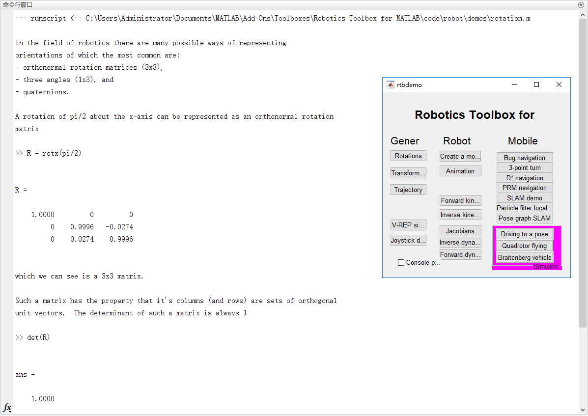

The main purpose of this chapter is to understand the kinematics characteristics of pincher arm, and be familiar with the modeling method of robot arm. Finally, using robot toolbox in MATLAB to control pincher arm.   
Reference resources: [petercorke](http://petercorke.com/wordpress/resources)

## Preparations:
### Step 1. Familiar with arm kinematics / DH parameter   
Read the following articles:   
[DH parameters](http://petercorke.com/wordpress/?ddownload=545)   
   

### Step 2. Install Robotics Toolbox
[Robotics Toolbox by Peter Corke](http://petercorke.com/wordpress/toolboxes/robotics-toolbox)    

### Step 3. Familiar with Robotics Toolbox
Run the demo `rtbdemo` to see what the toolbox can do. For example, when we push the Rotations button, MATLAB will run the results shown as below.
   

## Usage
### Step 1. Familiar with pincher kinematics
[4 is harder than 6DOF -- Inverse kinematics for underactuated robots](http://petercorke.com/wordpress/?ddownload=546)   
### Step 2. Control Pincher using Robotics Toolbox
[Interfacing a hobby robot arm to MATLAB -- Using the Robotics Toolbox with a real robot](http://petercorke.com/wordpress/?ddownload=547)   

