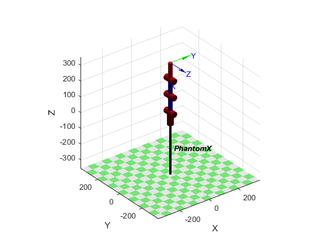
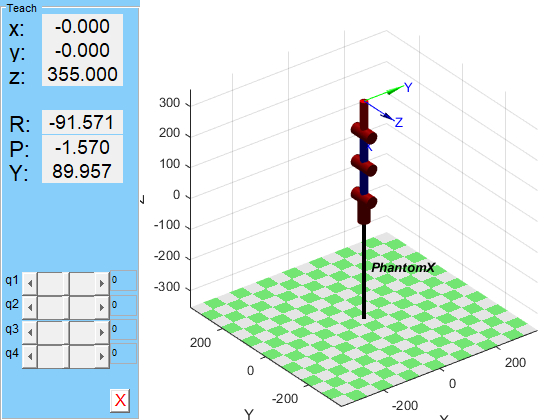
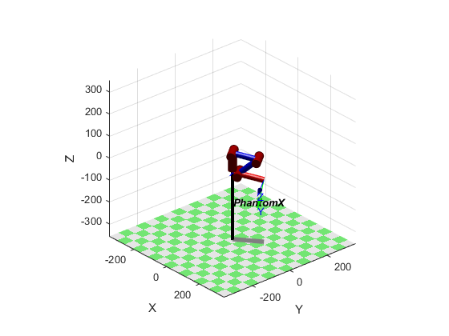
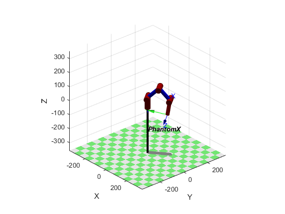

The main purpose of this chapter (project) is to understand the kinematics characteristics of pincher arm, and be familiar with the modeling method of robot arm. Finally, using robot toolbox in MATLAB to control pincher arm.   
Reference resources: [petercorke](http://petercorke.com/wordpress/resources)

## Preparations:
### Step 1. Familiar with arm kinematics / DH parameter   
Read the following articles to gain an understanding of DH parameters:   
[DH parameters](http://petercorke.com/wordpress/?ddownload=545)   
   

### Step 2. Install Robotics Toolbox   
Recommended Installation Method: Download [RTB-10.3.1 mltbx format (23.2 MB)](http://petercorke.com/wordpress/?ddownload=574) in MATLAB toolbox format (.mltbx) . From within the MATLAB file browser double click on this file, it will install and configure the paths correctly.   
Click [Robotics Toolbox by Peter Corke](http://petercorke.com/wordpress/toolboxes/robotics-toolbox) to know more about the Robotics Toolbox (RBT).    

### Step 3. Familiar with Robotics Toolbox
Run the demo `rtbdemo` to see what the toolbox can do. For example, when we push the Rotations button, MATLAB will run the results shown as below.
   
You can also read the file [robot.pdf](https://github.com/ViolinLee/Pincher_projects/blob/master/1_kinematics_in_matlab/resources/robot.pdf) which describes the functions in RBT in some detail. You can find this in the Toolbox as rvctools/robot/robot.pdf. 

## Usage
### Step 0. Familiar with Pincher Arm's DH parameters
However, there are different forms of DH parameters convention. The standard DH is used to described the structure of the pincher arm, as the following graphs shown.

**Fig 1. Pincher Arm Links**
   

**Fig 2. Definition of standard Denavit and Hartenberg link parameters.**
     
You can check the DH parameters of the pincher arm in MATLAB by commanding:

    >> mdl_phantomx
    >> px

   

### Step 1. Compute the Inverse Kinematics of Pincher Arm      
The following document describes how to determine inverse kinematics for pincher arm using the Robotics Toolbox for MATLAB: [4 is harder than 6DOF -- Inverse kinematics for underactuated robots](http://petercorke.com/wordpress/?ddownload=546). However, this documentation uses an old version RBT, and the coordinate configuration is different, which will lead to a inconsistent result.   
#### 1.Modification
The code need to been modified, you can test the inverse kinematics computation by texting the following commands in sequence:   
 
1) Moving to a position

    >> mdl_phantomx   
    >> px.plot(qz)   
    >> px.teach   
    >> Td = transl([100 80 -70])   
    >> q = px.ikine(Td, 'q0', qz, 'mask', [1 1 1 0 0 0])   
    >> px.plot(q)   
    >> px.fkine(q)   
    >> q = px.ikine(Td, 'q0', [0.5 1 -1 -0.5], 'mask', [1 1 1 0 0 0])   
    >> px.plot(q)   

2) Moving to a pose

    >> Td   
    >> Td = transl([100 80 -70]) * oa2tr([-1 0 0], [0 -1 0])   
    >> q = px.ikine(Td, 'q0', [0.5 1 -1 -0.5], 'mask', [1 1 1 1 0 0], 'tol', 0.8)   
    >> px.fkine(q)

#### 2.Instruction  
"Underactuation complicates the process of finding an inverse kinematic solution, and
it frustrates those who are new to robotics — those who just want to run the code and
get an answer. For a robot with 6 joints it’s quite straightforward, but underactuation
requires some careful thought about the problem that you are trying to solve — you
can’t just blindly use the tools."   

-- Peter Corke

We will consider the problem in two parts. First the problem of moving the robot
tool to a particular position. Second, moving the tool to a particular position and tool
orientation.   

1) Moving to a position   
First, load a model of pincher arm (The coordinate system configurations of pincher arm in RBT 10 release is consistent with what is described in Fig 1).   

    >> mdl_phantomx

and then plot it for default, all zero, joint angles (we will see that the robot is pointing straight upwards).

    >> px.plot(qz)

We can use the sliders in the teach pendant function.    

    >> px.teach

   
Now we will define the position we want the tool tip to move to

    >> Td = transl([100 80 -70]) 

and then compute the numerical inverse kinematics

    >> q = px.ikine(Td, 'q0', qz, 'mask', [1 1 1 0 0 0])
    
    q =    0.6747    1.7646   -2.2161    2.2219

Note that we have specified a mask value of (1 1 1 0 0 0) which indicates that we only care about errors in the x, y and z directions, rotational errors are to be ignored.   

    >> px.plot(q)

    
While this looks rather awkward the tool position is indeed what we requested.   

    >> px.fkine(q)   
    
    ans =    
       -0.7628   -0.1497    0.6290       100
       -0.6103   -0.1549   -0.7769        80
        0.2137   -0.9765    0.0268       -70
             0         0         0         1

Inverse kinematics is, in general, not uniquely defined. There are several arm configurations that will give the same tool position, and the numerical method has just chosen the awkward one. With a bit of trial and error, guided by the configuration we achieved using the teach pendant, we find that   

    >> q = px.ikine(Td, 'q0', [0.5 1 -1 -0.5], 'mask', [1 1 1 0 0 0])   
    q =    0.6747    0.8000   -1.6280   -0.8665
    >> px.plot(q)

2) Moving to a pose   
Looking from above of the pincher arm, we can see that the arm is a straight line and its angle is a function only of q1, the waist joint. The effective length of the line is a function of q2, q3 and q4. The height of the tool tip, is also a function of q2, q3 and q4. So while there is only one possible value of q1, there are infinite number of values of q2, q3 and q4 — it is a 3-bar linkage pinned at each end. Each particular choice of q2, q3 and q4 results in a different orientation of the tool’s z-direction — this is an unconstrained degree of freedom.

Now we want to control the orientation of the tool as well. The construction of the robot only allows us to control the tool x direction. The only way we could change the tool y or z direction would be to rotate q1 but this would violate the position requirement. For an underactuated robot arm it is critically important to understand what the mechanism can and cannot do, particularly when we are talking about controlling pose. The first step is to specify the desired pose. If we look at the value we set above

    >> Td

    Td =

     1     0     0   100
     0     1     0    80
     0     0     1   -70
     0     0     0     1

we see that the rotation part is an identity matrix, which has desired tool x-direction pointing upward in the world z-direction, as defined by the third column. This is imposible for the robot to achieve, to be reaching down towards the table top with its finger tips pointing upwards, as well as being non-useful for picking up an object on the table. We need to set the orientation part of the desired tool pose and we do that by

    >> Td = transl([100 80 -70]) * oa2tr([-1 0 0], [0 -1 0])

    Td =

     0    -1     0   100
     0     0    -1    80
     1     0     0   -70
     0     0     0     1

which postmultiplies by a rotational transform that has its x-axis in the world z direction, its y-axis in the negative world x-direction, and its z-axis in the negative world y-direction.    

The only remaining degree of freedom is evident when we look at the robot side on, the tool x-axis is not pointing quite downward. In order to change things so that it is, we must rotate the end-effector frame

    >> q = px.ikine(Td, 'q0', [0.5 1 -1 -0.5], 'mask', [1 1 1 1 0 0], 'tol', 0.8)

    q =

        0.6737    0.7993   -1.6284   -0.8671

    >> px.fkine(q)

    ans = 
        0.1403   -0.7514    0.6447       100
        0.1120   -0.6349   -0.7644     79.86
        0.9837    0.1795   -0.0049    -69.92
             0         0         0         1

    >> px.plot(q)

### Step 2. Control Pincher using Robotics Toolbox   
The following article describes how to interfacing pincher arm to MATLAB. However, when running a more advanced version of the Robotics Toolbox, you need to make appropriate changes to the code.   
[Interfacing a hobby robot arm to MATLAB -- Using the Robotics Toolbox with a real robot](http://petercorke.com/wordpress/?ddownload=547)    

#### 1.Connect arbotix to computer and record the USB port.   
On a Linux or MacOS system

    $ ls /dev/tty*

On windows, just check the Device Manager, and for my computer I see a newly inserted device in "COM3".   

#### 2.Flashing the Arbotix   
Next you need to ensure that the correct software is installed on the ArbotiX. Run Arduino, and use the Tools menu options to set the serial port and the type of board, select Arbotix. Select File/Sketchbook/pypose to open the `pypose` application source code and then verify it and upload it.   

#### 3.Driving the Robot   
#### 3.1 Make Matlab talk to your robot
Connect the robot to your computer as above and start MATLAB. Then add `robot/interfaces` to your path, which make the class Arbotix can be found.   

    addpath(fullfile( fileparts(which('startup_rvc')), 'robot', 'interfaces'))

Create workspace class:

    arb = Arbotix('port', 'COM3', 'nservos', 5)

Now you have a connection to the robot through the workspace class variable `arb`

#### 3.2 Exercising the robot    
Start with something innocuous, taking the temperature of the servo motors

    arb.gettemp

Get the actual angle of joint 1, the waist joint

    arb.getpos(1)

Get all the joint angles simultaneously

    q = arb.getpos([])

Try a cautious motion, we’ll move the gripper to its current position   

    arb.setpos(5, q(5))

and nothing happens. Let’s change the gripper angle

    arb.setpos(5, q(5)+0.5)

and we hear a noise and see the gripper fingers move slightly. Now move the whole robot to its initial location.

    arb.setpos(q)

and the gripper moves back to its original location.   
 
Enough with caution, let’s move all joints by a small amount

    arb.setpos(q + 0.1 * [1 1 1 1 0]);

This simple move command simply tells the servos to move a new position, and they go as fast as they can.
We can set the speed to something more sedate

    arb.setpos(q, 3 * [1 1 1 1 1]);

which moves back to the original pose but with all joints set to a velocity of 3 encoder units per second^2. The setpos() and getpos() methods make the conversion from encoder counts to angles.    

The robot is quite rigid since the Dynamixel servos are doing their job very well. We
can relax the robot by

    arb.relax()

which puts all the servos into a zero torque mode and we move the joints by hand. The only force we feel is due to the friction in the Dynamixel gearbox. Change the configuration of the robot and then check the new joint angles

    q = arb.getpos()

We can disable the relaxed mode by

    arb.relax([], false)

which causes the Dynamixels to start servoing to whatever joint angle they currently have.

### 4. A RobotArm object 
Note: This part can only be implemened in a lower version RTB (like RTB 9), since RTB 10 has remove the RobotArm Class!

So far we’ve been using two objects to represent our robot: `px` is the standard Toolbox kinematic model that performs kinematics, plotting, teaching and so on, and `arb` is an interface to the real robot. We can combine them into a single more useful object.

    arm = RobotArm(px, arb)
    
    about arm

`arm` is a subclass of the SerialLink class so it inherits all its methods. However it now has
a link to the real robot and some additional methods.

Let’s start with   

    arm.mirror()

which puts the arm into the relaxed mode mentioned earlier, but continually reads the joint angles and reflects them to a graphical version of the robot. As you move the physical robot you can see it moving on the screen. The joint angles can be obtained with

    q = arm.getq()

The gripper servo is treated separately from motor servos. We can close the gripper or fully open it 

    arm.gripper(0);
    
    arm.gripper(1);

We can move smoothly to a pose by

    arm.jmove(qz, 5)

which will move the robot to the desired joint configuration in 5 seconds. The actually trajectory used is computed using the Toolbox function `jtraj()`.

