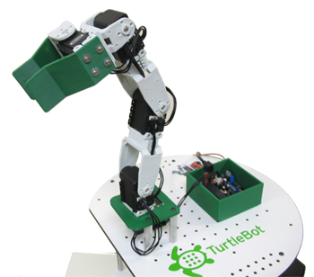

The purpose of this chapter is to familiarize ourselves with move_it ros package and use it to control the motion of pincher arm.

## Preparations
### ROS Packages:
1.[arbotix](http://wiki.ros.org/arbotix) -- ArbotiX Drivers   
2.[turtlebot_arm](http://wiki.ros.org/turtlebot_arm) -- The turtlebot arm meta package.   
Note that the turtlebot_arm package is use for the white-green TurtleBot-arm (as shown below) by default, so it is required to modify some code such that the package can be used to control the PhantomX-Pincher arm.   
   
In this project, we use a branch repository: [corot/turtlebot_arm](https://github.com/corot/turtlebot_arm)

### Arbotix firmware for ROS
If you have install the arduino IDE, and configured the arbotix library, you should skip this part. If not, you can follow the [familiar_with_pincher](https://github.com/ViolinLee/Pincher_projects/blob/master/0_familiar_with_pincher/familiar_with_pincher.md) in part 1, or visit the [pincher-arm official website (trossenrobotics)](https://learn.trossenrobotics.com/interbotix/robot-arms/pincher-arm). In addition, the library has a github repository: [arbotix](https://github.com/Interbotix/arbotix).

## Usage
Assume that you have install the arduino IDE and configure the library correctly and the required driver has been installed.    
### Step 1. Burn ros firmware into Arbotix-M

    File -> Sketchbook -> Arbotix Sketches -> ros   
    Tools -> Serial Port -> "The corresponding USB port"
    Tools -> Board -> Arbotix    

### Step 2. Install the Arbotix Package

    $ sudo apt-get update   
    $ sudo apt-get install ros-kinetic-arbotix

### Step 3. Confugure ros workspace
1.arbotix_ros

    $ cd ~/turtlebot_arm_ws/src/   
    $ git clone -b turtlebot2i https://github.com/Interbotix/arbotix_ros.git   
    $ cd ..   
    $ catkin_make   

2.turtlebot_arm

    $ cd ~/turtlebot_arm_ws/src   
    $ git clone https://github.com/corot/turtlebot_arm   
    $ cd ..   
    $ catkin_make   

### Step 4. Test servos
Then, you can check that you arm is effectively connected to your robot (or computer machine). Connect the PhantomX Pincher arm through USB port to your robot laptop and plug power cable to socket. make sure that you have read, write and execute access on the USP port using this command

    $ sudo chmod 777 /dev/ttyUSB0

Assuming that your arm is connected on port ttyUSB0 to the robot laptop. Then, execute the following command:

    $ arbotix_terminal

You should see the following:

    ArbotiX Terminal --- Version 0.1
    Copyright 2011 Vanadium Labs LLC
    >>

You can check that your servos are all active using the `ls` command

    ArbotiX Terminal --- Version 0.1   
    Copyright 2011 Vanadium Labs LLC   
    >>  ls   
    1    2    3    4    5 .... .... .... ....   
    .... .... .... .... .... .... .... .... ....   
   

### Step 5. Test and Develop the Arm PhantomX Pincher robot

