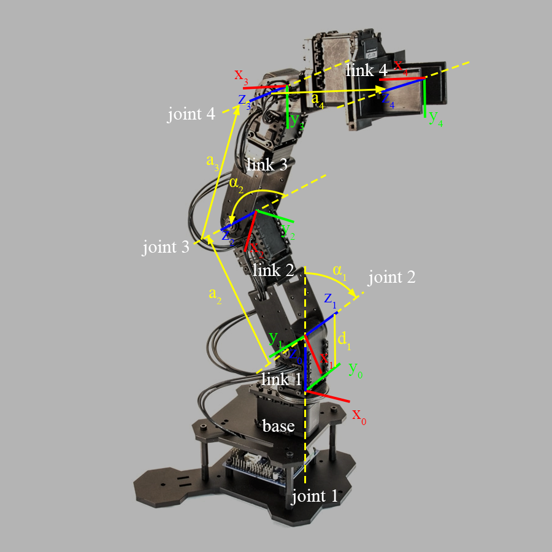

The project contains four sub-projects that will guid you to use PhantomX pincher arm step by step. In the process of completing the project, you will have a deeper understanding of the kinematics of the serial manipulator.    

### [Start: Familiar with Pincher](https://github.com/ViolinLee/Pincher_projects/tree/master/0_familiar_with_pincher)
The main purpose of this chapter is to familiarize ourselves with pincher arm hardware through using official software.   

### [Project 1. Kinematics in Matlab](https://github.com/ViolinLee/Pincher_projects/tree/master/1_kinematics_in_matlab)
The main purpose of this chapter (project) is to understand the kinematics characteristics of pincher arm, and be familiar with the modeling method of robot arm. Finally, using robot toolbox in MATLAB to control pincher arm.   

### [Project 2. Kinematics in ROS](https://github.com/ViolinLee/Pincher_projects/tree/master/2_kinematics_in_ros)
The purpose of this chapter (project) is to familiarize ourselves with move_it ros package and use it to control the motion of pincher arm.

### [Project 3. Pincher Vision](https://github.com/ViolinLee/Pincher_projects/tree/master/3_pincher_vision)
The main purpose of this chapter (project) is to integrate camera with pincher arm through ros. 

### Project 4. Turtlebot Pincher Arm
The main purpose of this chapter (project) is to learn how to use a manipulator mounted on a moving chassis.

